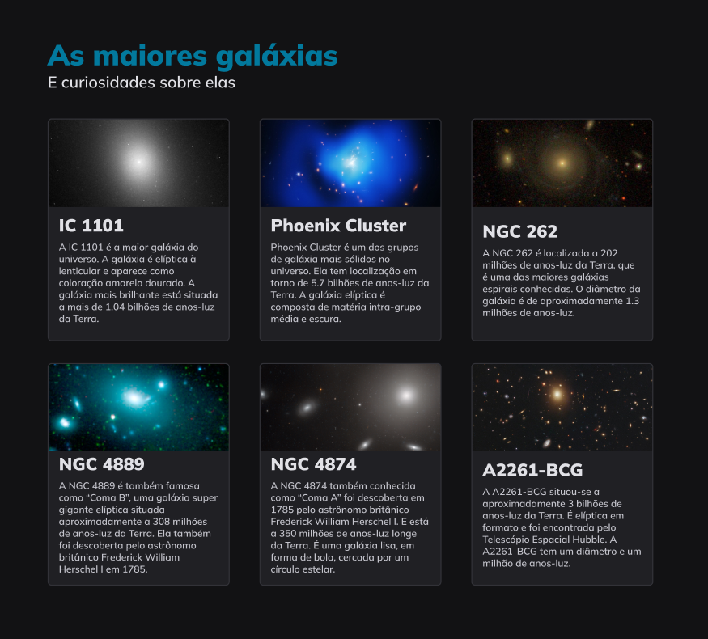

<h1 align="center"> Introdução ao Grid </h1>

Estudo voltado aos fundamentos de grid.

 

  

## 🚀 Tecnologias

Esse projeto foi desenvolvido com as seguintes tecnologias:

- HTML e CSS 
- Git e GitHub

## 🔖 Layout

Você pode visualizar o layout do projeto através [DESSE LINK](https://www.figma.com/file/xgy27M33lWWA2noj9WYEFH/Galaxies-%E2%80%A2-Projeto-Explorer-(Community)?node-id=0%3A1&mode=dev). É necessário ter conta no [Figma](https://figma.com) para acessá-lo.

---

Feito com o ❤️!
